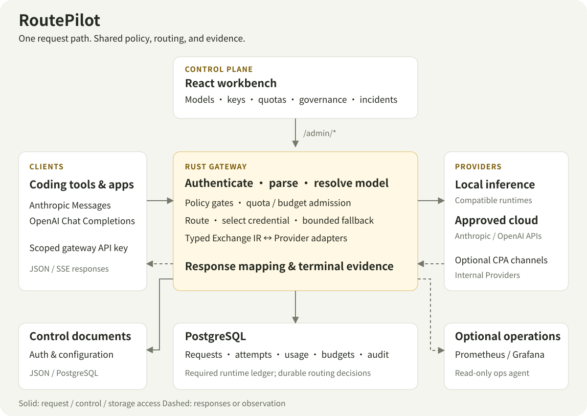

# RoutePilot

**One gateway for your team's local and cloud models.**

Connect coding tools and applications to a stable API. Keep credentials, routing,
access policies, and request evidence in a self-hosted workbench.

[](https://github.com/lizzjin/RoutePilot/actions/workflows/ci.yml)
[](LICENSE)

**English** · [简体中文](README.zh-CN.md) · [Getting started](docs/GETTING_STARTED.md) · [Documentation](docs/README.md)

RoutePilot is a Rust LLM gateway with a React operations console and a PostgreSQL
ledger. It is built for internal development teams of roughly **20–50 people**
that combine local inference with approved cloud Providers. The current release
line is **v0.1.x / Small-Team Beta**, with a Chinese-first dashboard.

## A workbench for everyday model operations


*Current dashboard with built-in demonstration data. The figures illustrate the
interface; they are not production measurements or performance benchmarks.*

The console follows the work an operator does, from spotting a failed request to
finding its route and managing the credentials behind it.

| Workspace | What you can do |
| --- | --- |
| **Run** | Review traffic and usage, inspect request details beside the request queue, investigate operational incidents, and follow ledger evidence. |
| **Configure** | Manage models, Providers, and credential pools; inspect runtime settings. Runtime settings are currently read-only. |
| **Access & governance** | Issue scoped API keys, manage users and teams, set quotas, and record policy changes and approvals. |
| **Integration guide** | Find connection instructions and examples for client tools. |

The workbench supports light, dark, and system themes. On narrow screens,
request investigation moves from a side-by-side queue and detail view to a
list-to-detail flow. Unsaved edits and one-time API-key handoff have explicit
navigation protection.

## What RoutePilot handles

**A stable client entry point.** Claude Code, SDKs, and internal applications
can use Anthropic Messages or the documented OpenAI-compatible Chat Completions
contract. Provider adapters map supported text, streaming, and Tool Use semantics
through a typed intermediate representation.

**Routes you can explain.** Start with explicit Providers, model aliases, and
prefix routes. Evaluate optional smart routing in shadow mode, then use bounded
canaries before activation. Routing decisions are stored with the request;
credential pools, cooldowns, and eligible fallback paths handle upstream failures.

**Access and spending controls before egress.** Keep Provider secrets on the
server and give clients scoped gateway keys. Apply model/Provider permissions,
project egress policies, quotas, and budget reservations before an upstream call.
Cloud access requires an explicit project policy and an eligible data classification.

**Evidence after the request.** Inspect attempts, terminal outcomes, usage,
routing decisions, and audit records in PostgreSQL. Usage retains its source:
Provider-reported values and local estimates are distinguishable. These records
support operations and cost estimates; they do not replace a Provider invoice.

## How it fits together



The Rust gateway owns the request path and the `/admin/*` control plane. The React
console uses that control plane; PostgreSQL is required for the running server's
request, usage, budget, and audit ledger. Low-frequency authentication and control
configuration can use JSON or PostgreSQL-backed documents.

For each request, RoutePilot authenticates the client, parses the protocol,
resolves the model, checks eligible routes and policy, and reserves configured
usage/budget before sending an attempt. It maps the response back to the client's
protocol and finalizes the request evidence. A stream that has already started
cannot be replayed through another Provider.

Local inference runtimes and approved cloud endpoints sit behind the same
Provider boundary. An optional CPA deployment can supply Codex/Claude account
channels as internal Providers. Prometheus/Grafana and the optional read-only
operations agent extend observation; the agent is off by default and does not
execute shell commands, SQL, or automatic configuration changes.

Read the [architecture and request lifecycle](docs/ARCHITECTURE.md),
[Provider contracts](docs/PROVIDERS.md), and [agent rollout guide](docs/OPS_AGENT.md)
for the implementation boundaries.

## Run your own instance

### 1. Configure a source checkout

The current installation path builds from source. Prebuilt release instructions
in the deployment guide apply only once the corresponding tag and images have
been published. The supported deployment target is **Linux x86_64 with Docker
Engine and Docker Compose v2**; Docker builds the Rust and dashboard artifacts.

```bash
git clone https://github.com/lizzjin/RoutePilot.git
cd RoutePilot
cp deploy/docker/routepilot.env.example .env
cp config.example.toml config.toml
```

Edit `.env` and `config.toml` before starting. Replace all required credential
placeholders, including the gateway token, administrator password, PostgreSQL
password, and the chosen Provider's secret. The default example uses DeepSeek;
for local inference or a mixed topology, follow the
[Provider configuration recipes](docs/CONFIGURATION.md#provider-topology-recipes).

### 2. Build, start, and check

```bash
export ROUTEPILOT_COMPOSE_FILE="$PWD/docker-compose.yml"
scripts/build-container.sh
ROUTEPILOT_LOCAL_BUILD=1 scripts/compose-up.sh
scripts/smoke-test.sh
```

The build script expects a clean Git checkout. For local evaluation of your own
uncommitted changes, use `scripts/build-container.sh --allow-dirty`.
The smoke check verifies the local service without calling an upstream model.

| Entry point | Default address | Credentials |
| --- | --- | --- |
| Dashboard | `http://127.0.0.1:33002` | `ROUTEPILOT_ADMIN_USERNAME` / `ROUTEPILOT_ADMIN_PASSWORD` from `.env` |
| Gateway | `http://127.0.0.1:38082` | A scoped client key; the configured shared token can be used for initial local testing. |

### 3. Connect a client

Create a scoped key in **Access & governance → API keys** and configure your
client with the matching endpoint:

| Client contract | Base URL | Inference endpoint |
| --- | --- | --- |
| Anthropic Messages | `http://127.0.0.1:38082` | `POST /v1/messages` |
| OpenAI-compatible Chat Completions | `http://127.0.0.1:38082/v1` | `POST /v1/chat/completions` |

`GET /v1/models` exposes the model catalog. Choose a configured model or logical
alias in your client. Provider credentials remain on the gateway.

For a cloud request, first apply the explicit project policy described in
[Getting Started](docs/GETTING_STARTED.md). That guide includes the narrow
DeepSeek policy, classification headers, and a complete first-request example.
Unclassified requests remain local-only; a real upstream request can consume
Provider quota.

For shared access, follow the [production guide](docs/PRODUCTION.md) to configure
HTTPS, trusted proxies, secure cookies, and backups before opening the service to
your team. The Compose defaults bind the published application ports to loopback.

## Choose your next step

| Your task | Read |
| --- | --- |
| Finish installation or troubleshoot startup | [Getting Started](docs/GETTING_STARTED.md) · [Configuration](docs/CONFIGURATION.md) |
| Connect local inference or a new Provider | [Local inference stack](docs/LOCAL_INFERENCE_STACK.md) · [Providers](docs/PROVIDERS.md) · [Tool Use compatibility](docs/TOOL_USE_COMPATIBILITY.md) |
| Integrate a client or evaluate routing | [API reference](docs/API.md) · [Smart routing](docs/SMART_ROUTING.md) |
| Deploy, observe, and recover | [Deployment](docs/DEPLOYMENT.md) · [Operations](docs/OPERATIONS.md) · [Observability runbook](docs/OBSERVABILITY_RUNBOOK.md) · [Upgrade & rollback](docs/UPGRADING.md) |
| Understand the design or contribute | [Architecture](docs/ARCHITECTURE.md) · [Development](docs/DEVELOPMENT.md) · [Roadmap](docs/ROADMAP.md) |

The [documentation index](docs/README.md) and [role-based learning paths](docs/LEARNING_PATH.md)
provide a fuller reading order.

## Project status and participation

Small-Team Beta targets **one backend instance on a trusted host or small trusted
network**, with PostgreSQL 18.4 and a current Chromium-family browser. Public
multi-tenancy and high availability are outside the current support scope.
The client contract covers documented Messages and Chat Completions features;
Responses, image/audio APIs, and arbitrary Provider extensions are not included.
See the [compatibility matrix](docs/COMPATIBILITY.md) for supported, evaluation,
and experimental combinations.

Contributions are welcome through [issues](https://github.com/lizzjin/RoutePilot/issues)
and pull requests. Start with the [development guide](docs/DEVELOPMENT.md) for
Rust, Node, PostgreSQL, and the required `scripts/check-all.sh` checks. Report
security vulnerabilities through [Security](SECURITY.md).

RoutePilot is free, self-hosted software under the [MIT license](LICENSE).
[Privacy](PRIVACY.md) · [Support](SUPPORT.md) · [Governance](GOVERNANCE.md)
