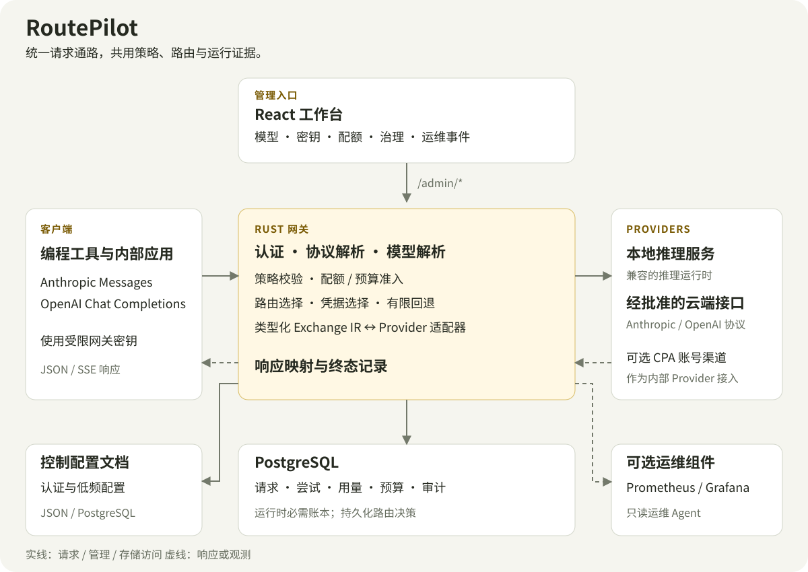

# RoutePilot

**让团队的本地模型与云端模型，共用一个可管理的入口。**

为编程工具和内部应用提供稳定的 API，把密钥、路由、访问策略和请求记录集中到自己的工作台。

[](https://github.com/lizzjin/RoutePilot/actions/workflows/ci.yml)
[](LICENSE)

[English](README.md) · **简体中文** · [开始使用](docs/GETTING_STARTED.md) · [文档中心](docs/README.md)

RoutePilot 是一个由 **Rust 网关、React 运维工作台和 PostgreSQL 账本**组成的自托管 LLM 网关，面向约 **20–50 人的内部研发团队**，适合同时使用本地推理服务与经批准的云端模型。当前处于 **v0.1.x / 小团队 Beta** 阶段，工作台以中文体验为主。

## 从日常工作出发的模型工作台


*截图来自当前工作台的内置演示模式。数字用于展示界面，不代表生产运行数据或性能测试结果。*

从发现请求失败，到查看路由与尝试记录，再到管理背后的渠道和密钥，工作台按操作任务组织入口。

| 工作区 | 可以完成的工作 |
| --- | --- |
| **运行** | 查看流量与用量，在请求队列旁检查详情，调查运维事件，追溯运行账本。 |
| **配置** | 管理模型、Provider 与凭据池，查看运行设置；运行设置目前为只读。 |
| **访问与治理** | 签发有范围限制的 API 密钥，管理用户与团队，设置配额，记录策略变更与审批。 |
| **接入指南** | 查找客户端连接方法与接入示例。 |

工作台支持浅色、深色和跟随系统主题。桌面端的请求排查采用队列与详情并列布局，窄屏下切换为列表进入详情；未保存的编辑和只能展示一次的密钥交接，都有明确的离开保护。

## 从接入到追溯，网关负责什么

**统一客户端入口。** Claude Code、SDK 和内部应用可通过 Anthropic Messages 或已明确支持的 OpenAI Chat Completions 协议接入。协议适配器通过类型化中间表示，转换受支持的文本、流式响应和 Tool Use 语义。

**可解释的路由选择。** 从指定 Provider、模型别名和前缀路由开始；需要智能路由时，先用影子模式评估，再通过受控灰度逐步启用。路由决策随请求保存，凭据池、冷却机制和符合条件的回退路径共同处理上游故障。

**请求出站前的权限与预算控制。** 上游密钥留在服务端，客户端只领取网关签发的受限密钥。模型与 Provider 权限、项目出站策略、配额和预算预留在上游调用前执行。云端访问需要明确的项目策略与符合要求的数据分类。

**请求结束后的运行证据。** 在 PostgreSQL 中保留尝试记录、终态、用量、路由决策和审计记录。用量标明来源，区分上游返回与本地估算，便于排查问题和估算成本；它们不替代供应商账单。

## 系统如何协作



Rust 网关同时承担请求处理和 `/admin/*` 管理接口。React 工作台通过管理接口操作；运行中的服务必须连接 PostgreSQL，保存请求、用量、预算和审计账本。低频的认证与控制配置可以使用 JSON 或 PostgreSQL 文档存储。

每次请求依次经过客户端认证、协议解析、模型解析与候选路由检查，并在上游尝试发出前完成策略校验及已配置的用量／预算预留。响应转换回客户端协议后，网关完成请求记录与用量结算。已经开始向客户端发送的流式响应，不能再通过另一条渠道重放。

本地推理服务与经批准的云端接口都位于同一 Provider 边界后。可选的 CPA 部署也以内部 Provider 的方式接入 Codex／Claude 账号渠道。Prometheus／Grafana 和只读运维 Agent 用于扩展观测能力；Agent 默认关闭，不执行 Shell、SQL 或自动修改配置。

实现细节见[架构与请求生命周期](docs/ARCHITECTURE.md)、[Provider 接入约定](docs/PROVIDERS.md)和 [Agent 启用指南](docs/OPS_AGENT.md)。

## 启动自己的实例

### 1. 准备源码和配置

当前安装路径采用源码构建。部署文档中的预构建 Release 流程，需要相应标签与镜像发布后才能使用。受支持的部署环境为 **Linux x86_64、Docker Engine 和 Docker Compose v2**；Rust 与工作台构建在 Docker 中完成。

```bash
git clone https://github.com/lizzjin/RoutePilot.git
cd RoutePilot
cp deploy/docker/routepilot.env.example .env
cp config.example.toml config.toml
```

启动前编辑 `.env` 与 `config.toml`，替换所有必填凭据占位符，包括网关令牌、管理员密码、PostgreSQL 密码和所选 Provider 的密钥。默认示例使用 DeepSeek；本地推理或混合部署可参考 [Provider 配置方案](docs/CONFIGURATION.md#provider-topology-recipes)。

### 2. 构建、启动并检查

```bash
export ROUTEPILOT_COMPOSE_FILE="$PWD/docker-compose.yml"
scripts/build-container.sh
ROUTEPILOT_LOCAL_BUILD=1 scripts/compose-up.sh
scripts/smoke-test.sh
```

构建脚本默认要求 Git 工作区干净。若要在本地评估尚未提交的修改，可使用 `scripts/build-container.sh --allow-dirty`。上述冒烟检查仅检查本地服务，不调用上游模型。

| 入口 | 默认地址 | 认证方式 |
| --- | --- | --- |
| 工作台 | `http://127.0.0.1:33002` | `.env` 中的 `ROUTEPILOT_ADMIN_USERNAME` / `ROUTEPILOT_ADMIN_PASSWORD` |
| 网关 | `http://127.0.0.1:38082` | 受限客户端密钥；首次本地测试也可使用配置的共享令牌。 |

### 3. 接入客户端

在**访问与治理 → API 密钥**中签发受限密钥，为客户端选择对应入口：

| 客户端协议 | Base URL | 推理端点 |
| --- | --- | --- |
| Anthropic Messages | `http://127.0.0.1:38082` | `POST /v1/messages` |
| OpenAI 兼容 Chat Completions | `http://127.0.0.1:38082/v1` | `POST /v1/chat/completions` |

`GET /v1/models` 提供模型目录。客户端选择已配置的模型或逻辑别名，上游供应商凭据始终保留在网关侧。

发送云端请求前，先按[入门指南](docs/GETTING_STARTED.md)应用明确的项目策略。指南包含最小范围的 DeepSeek 策略、数据分类请求头和完整的首次请求示例。未分类的请求仍限制在本地；真实上游调用可能消耗供应商额度。

共享给团队前，请按[生产指南](docs/PRODUCTION.md)配置 HTTPS、可信代理、安全 Cookie 和备份。Compose 默认仅将应用端口绑定在本机回环地址。

## 按任务继续阅读

| 你接下来要做什么 | 推荐文档 |
| --- | --- |
| 完成安装、处理启动问题 | [入门指南](docs/GETTING_STARTED.md) · [配置参考](docs/CONFIGURATION.md) |
| 接入本地推理或新的模型渠道 | [本地推理栈](docs/LOCAL_INFERENCE_STACK.md) · [Providers](docs/PROVIDERS.md) · [Tool Use 兼容性](docs/TOOL_USE_COMPATIBILITY.md) |
| 对接客户端、评估路由 | [API 参考](docs/API.md) · [智能路由](docs/SMART_ROUTING.md) |
| 部署、观测与故障恢复 | [部署指南](docs/DEPLOYMENT.md) · [运维手册](docs/OPERATIONS.md) · [可观测性手册](docs/OBSERVABILITY_RUNBOOK.md) · [升级与回滚](docs/UPGRADING.md) |
| 理解设计或参与开发 | [系统架构](docs/ARCHITECTURE.md) · [开发指南](docs/DEVELOPMENT.md) · [路线图](docs/ROADMAP.md) |

更完整的阅读顺序见[文档中心](docs/README.md)和[按角色划分的学习路径](docs/LEARNING_PATH.md)。

## 项目阶段与参与方式

小团队 Beta 面向**可信主机或小型可信网络中的单个后端实例**，基线为 PostgreSQL 18.4 与当前 Chromium 系浏览器。公开多租户和高可用部署不在当前支持范围内。客户端协议覆盖已记录的 Messages 与 Chat Completions 功能，不包含 Responses、图像／音频 API 或任意供应商扩展。受支持、评估与实验性环境的区别见[兼容性矩阵](docs/COMPATIBILITY.md)。

欢迎通过 [Issue](https://github.com/lizzjin/RoutePilot/issues) 和 Pull Request 参与。开发前请阅读[开发指南](docs/DEVELOPMENT.md)，准备 Rust、Node 和 PostgreSQL 环境，并运行要求的 `scripts/check-all.sh` 检查。安全漏洞请按[安全政策](SECURITY.md)报告。

RoutePilot 以 [MIT 协议](LICENSE)免费开源，由使用者自行部署。
[隐私说明](PRIVACY.md) · [支持方式](SUPPORT.md) · [项目治理](GOVERNANCE.md)
