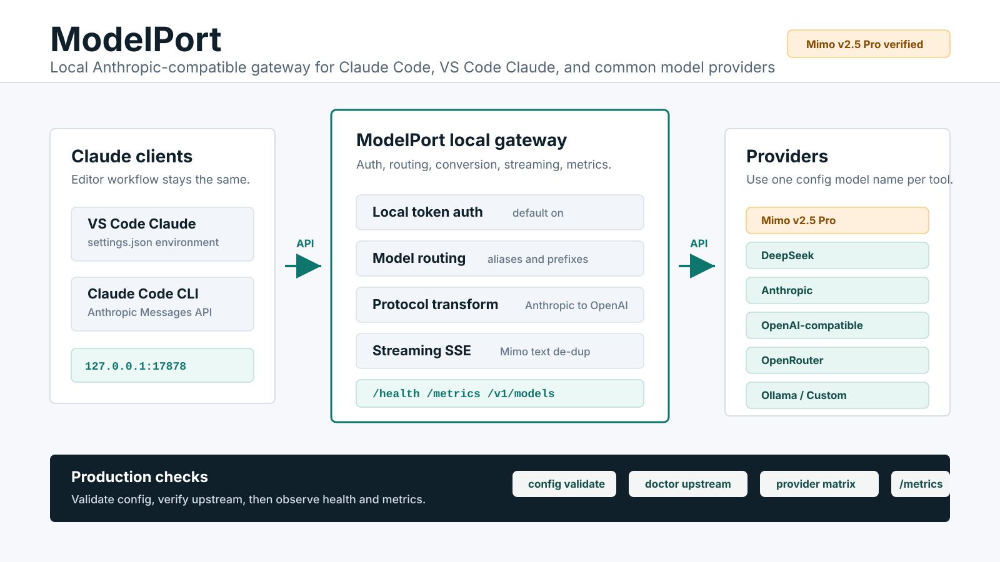

# ModelPort

[](https://github.com/tiammomo/ModelPort/actions/workflows/ci.yml)
[](https://github.com/tiammomo/ModelPort/actions/workflows/codeql.yml)
[](https://scorecard.dev/viewer/?uri=github.com/tiammomo/ModelPort)
[](LICENSE)

[English](README.md) | **简体中文**

ModelPort 是面向 Anthropic-compatible 和 OpenAI-compatible 客户端的自托管
LLM 网关。Claude Code、SDK 和内部应用可以通过一个入口统一获得鉴权、模型
路由、配额、用量、Provider 健康、请求证据和运维能力。



## 主要能力

- `POST /v1/messages`、`POST /v1/chat/completions`、`GET /v1/models` 和
  显式开启的精确 Token 计数。
- Anthropic 与 OpenAI-compatible Provider 适配、受限流式传输和 Tool Use
  转换。
- 可选的 CPA Codex/Claude 账号通道；CPA 只作为内部 Provider，统一受
  ModelPort 的策略、路由和证据边界管理。
- 确定性路由，以及支持 Shadow、稳定灰度和持久化决策证据的可解释智能路由。
- 有作用域的客户端 API Key、用户、团队、配额、消费控制、Provider 凭证池、
  冷却和受限回退。
- React 运维控制台和 PostgreSQL 请求、用量、预算与审计账本。
- Docker Compose、systemd、备份恢复、Prometheus 指标和验收脚本。

ModelPort 当前支持单台可信主机或小型可信网络。它不是公网多租户服务、模型
运行时、聊天界面、支付系统或 Provider 账单。扩大部署范围前请阅读
[生产投产](docs/PRODUCTION.md)和[路线图](docs/ROADMAP.md)。

## 快速开始

要求：Git、Docker、Docker Compose v2，以及至少一个 Provider 的凭证。默认示例
使用 DeepSeek 的 Anthropic-compatible 接口。

```bash
git clone https://github.com/tiammomo/ModelPort.git
cd ModelPort
cp deploy/docker/modelport.env.example .env
cp config.example.toml config.toml
```

编辑 `.env`，替换所有必填的 `replace-with-...` 值。至少设置不同的路由器、
管理员、PostgreSQL 和 Provider 凭证。首次本地测试时，让
`MODELPORT_AUTH_TOKEN` 与客户端侧 `ANTHROPIC_AUTH_TOKEN` 保持一致。

```bash
scripts/doctor.sh --setup
scripts/build-container.sh
scripts/compose-up.sh
docker compose ps
scripts/smoke-test.sh
```

打开 `http://127.0.0.1:33002`，使用
`MODELPORT_ADMIN_USERNAME`/`MODELPORT_ADMIN_PASSWORD` 登录。

使用本地 Qwen、其他 Provider、生产加固或排障时，继续阅读经过验证的
[上手指南](docs/GETTING_STARTED.md)。

## 发送第一个请求

```bash
source .env

curl -fsS \
  -H "x-api-key: $MODELPORT_AUTH_TOKEN" \
  -H 'content-type: application/json' \
  http://127.0.0.1:38082/v1/messages \
  -d '{
    "model":"deepseek-v4-flash",
    "max_tokens":96,
    "messages":[{"role":"user","content":"Reply exactly: OK"}]
  }'
```

该请求可能消耗 Provider 额度。`scripts/smoke-test.sh` 只做本地检查；明确希望
发送付费合成请求时再使用 `scripts/smoke-test.sh --upstream`。

Claude Code：

```env
ANTHROPIC_BASE_URL=http://127.0.0.1:38082
ANTHROPIC_AUTH_TOKEN=<MODELPORT_AUTH_TOKEN>
ANTHROPIC_MODEL=deepseek-v4-flash
```

OpenAI-compatible SDK：

```env
OPENAI_BASE_URL=http://127.0.0.1:38082/v1
OPENAI_API_KEY=<ModelPort 客户端 API Key>
OPENAI_MODEL=deepseek-v4-flash
```

共享部署应使用控制台签发的有作用域客户端 API Key。Provider 密钥只保留在
ModelPort 服务端，不能复制到客户端应用。

## 文档

按任务选择文档，不需要通读全部内容：

- [上手指南](docs/GETTING_STARTED.md)：安装、首次登录、首次请求和启动排障。
- [快速学习路径](docs/LEARNING_PATH.zh-CN.md)：面向使用者、接入人员、运维和
  贡献者的 30–60 分钟分层课程。
- [本地推理联合上手](docs/LOCAL_INFERENCE_STACK.md)：在 Linux/WSL2 中配合
  local-inference-stack 完成只读检查、受控启动和联合验收。
- [配置参考](docs/CONFIGURATION.md)：环境变量和 TOML。
- [API 参考](docs/API.md)：客户端和控制面接口契约。
- [Provider](docs/PROVIDERS.md)：托管 Provider、本地运行时和兼容性证据。
- [智能路由](docs/SMART_ROUTING.md)：评分、Shadow、灰度和回滚。
- [部署](docs/DEPLOYMENT.md)：Docker Compose、systemd 和生产拓扑。
- [运维](docs/OPERATIONS.md)：健康、日志、指标、备份、保留策略、事故和升级。
- [生产投产](docs/PRODUCTION.md)：上线与发布验收。
- [开发](docs/DEVELOPMENT.md)：贡献者工作流和测试矩阵。
- [文档索引](docs/README.md)：按角色导航。

## 安全与支持

保持后端和 PostgreSQL 端口私有。共享部署应使用同源 HTTPS、精确可信代理
CIDR、安全 Cookie、CSRF 防护和控制台 API Key。不要提交 `.env`、Provider
密钥、备份、Prompt、响应或原始敏感日志。

请阅读[安全策略](SECURITY.md)、[隐私说明](PRIVACY.md)、
[支持政策](SUPPORT.md)和[项目治理](GOVERNANCE.md)。除非另有书面协议，社区
支持不提供 SLA。

## 本地开发

```bash
cp .env.example .env
cp config.example.toml config.toml
# 替换必填 placeholder
scripts/start.sh

cd dashboard
npm ci
npm run dev
```

提交变更前：

```bash
scripts/check-all.sh
```

## 许可证

[MIT](LICENSE)
